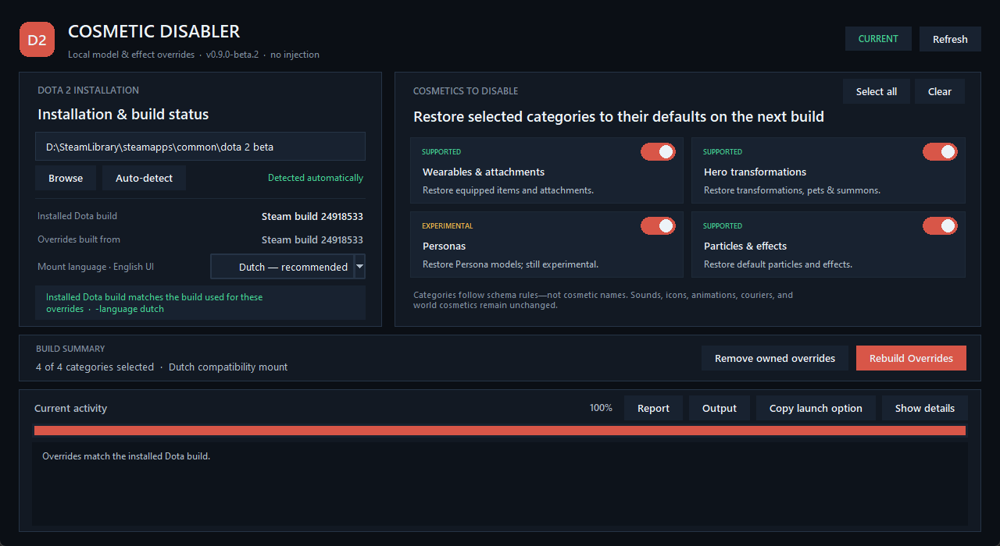

<h1 align="center">Dota 2 Cosmetic Disabler</h1>

<p align="center">
  <strong>Restore supported Dota 2 cosmetics to their default models and effects,<br />
  using only assets from your installed game.</strong>
</p>

<p align="center">
  <a href="https://github.com/ilariodeangelis77/dota2-disable-cosmetics/releases/latest"></a>
  <br />
  <sub>Windows, Linux, and macOS — choose the archive for your platform.</sub>
</p>

<p align="center">
  <a href="https://github.com/ilariodeangelis77/dota2-disable-cosmetics/actions/workflows/build-releases.yml"></a>
  <a href="LICENSE"></a>
</p>

<p align="center">
  <a href="https://github.com/ilariodeangelis77/dota2-disable-cosmetics/releases"><strong>Releases</strong></a>
  · <a href="#why-use-it">Why use it?</a>
  · <a href="#quick-start">Quick start</a>
  · <a href="#supported-replacements">Features</a>
  · <a href="#command-line-usage">CLI</a>
  · <a href="#development">Build from source</a>
  · <a href="https://github.com/ilariodeangelis77/dota2-disable-cosmetics/issues/new/choose">Report a bug</a>
</p>

<p align="center">
  
</p>

<p align="center"><sub>The dashboard showing stacked setup controls beside the persistent activity log.</sub></p>

> [!IMPORTANT]
> This project is in beta. It has passed automated, packaged, and live-install schema validation,
> but the latest mapping changes still require a broader in-game visual pass. Test a new build in the
> Armory, Demo Hero, or a custom lobby before using it in normal play.

Dota 2 Cosmetic Disabler is a self-contained desktop and command-line tool that restores many
equipped cosmetic models and effects to their default Dota 2 resources. It generates replacements
from the user's installed game data, allowing the mapping to be rebuilt after Dota updates instead
of relying on a static cosmetic list.

## Why use it?

> **Read the hero before the cosmetic.**

Valve's official
[Dota 2 Workshop Character Art Guide](https://help.steampowered.com/en/faqs/view/0688-7692-4D5A-1935)
describes a visual language designed to keep every hero immediately identifiable from above during
gameplay. It emphasizes recognizable silhouettes, deliberate color and value contrast, areas of
visual rest, and details that remain readable at game-view distance. The guide even gives the
in-game view higher priority than the loadout presentation.

The guide allows cosmetics to depart from default silhouettes and colors, provided that they
preserve identification and gameplay readability. As Dota's cosmetic catalogue has expanded,
however, some players find elaborate sets, recolors, Personas, Arcanas, model swaps, and particle
effects harder to parse quickly than the original hero designs. This tool provides a client-side
way to return supported assets to that more familiar visual language.

- **Faster recognition:** Keep hero silhouettes and facing cues closer to their defaults.
- **Familiar color hierarchy:** Return supported models and materials to established hero palettes
  and values.
- **Less visual noise:** Replace supported cosmetic particles and attachments with their defaults or
  safe neutral fallbacks.
- **Better performance:** Improve framerate by reducing supported cosmetic effects and complex
  alternate assets.

## Highlights

| | |
| --- | --- |
| **🔄 Patch-aware mappings**<br />Rebuilds from the economy and unit schemas in the currently installed game. | **📦 Self-contained releases**<br />Includes Python and both compiled-resource helpers. |
| **🎛️ Four clear replacement choices**<br />Choose wearables, transformations, Personas, and effects without exposing internal schema categories. | **🧭 Update detection**<br />Records the source Dota build and reports when an override becomes stale. |
| **🖥️ Dashboard and CLI**<br />Use the native desktop interface or automate the same workflow from a terminal. | **🛡️ Conservative deployment**<br />Owns one checksummed VPK and never overwrites an unrelated archive. |

## Requirements

Packaged releases require only:

- Windows x64, Linux x64, or macOS 15 or later on Intel or Apple Silicon.
- A local Dota 2 installation.

Linux releases target the Ubuntu 22.04 glibc baseline. macOS releases are not signed or notarized,
and GitHub-hosted Windows releases are not code-signed.

## Quick start

1. Download and extract the archive for your operating system.
2. Start `Dota2CosmeticDisabler.exe` on Windows or `./Dota2CosmeticDisabler` on Linux and macOS.
3. Confirm the detected Dota installation and choose the cosmetic categories to replace.
4. Keep **Dutch** selected as the compatibility mount unless you have a reason to use another
   supported language, then select **Build Overrides**.
5. Add the launch option shown by the application to Dota 2 in Steam:

   ```text
   -language dutch
   ```

6. Start Dota and verify the result in the Armory, Demo Hero, or a custom lobby.

Remove the launch option to disable the generated override immediately. Use
**Remove owned overrides** in the dashboard when you also want to remove the tool-owned VPK.

## Desktop dashboard

The dashboard can:

- Detect a Dota installation or accept a manually selected path.
- Show the installed Dota build, the build used by the current overrides, and their status.
- Select a recognized language mount and any combination of supported categories.
- Review the current category and language selection directly below the category toggles before
  starting; cleanup remains available there as a secondary maintenance action.
- Build and clean in the background while displaying real item, resource, model, material,
  particle, and per-file progress on a determinate bar with `0.1%` display precision.
- Keep the complete timestamped activity history visible in a full-height log beside the setup
  controls.
- Open generated reports and output folders, or copy the required Steam launch option, after a
  usable override result is available.

Language and category preferences are stored locally in `.work/ui-settings.json`. Keep the
dashboard open while a build or cleanup is running.

## Supported replacements

| Category | Current coverage |
| --- | --- |
| Wearables and attachments | Normal and alternate-style `model_player` resources, integrated-slot items, bodygroup-sensitive compatibility models, and `additional_wearable` attachments. |
| Hero transformations | Schema-driven `entity_model`, `base_model`, `entity_clientside_model`, `hero_model_change`, model-to-model, pet, summon, ward, and similar special-model rules. |
| Personas — experimental | Persona wearables that can be restored safely, with invisible fallbacks when a normal-hero attachment would be incompatible. This remains independently selectable because its coverage has more known edge cases. |
| Particles and effects | Declared particle replacements, cosmetic particle additions with a safe inferred default, and particle snapshots. |

Where applicable, selected model categories also restore confidently matched material variants and
add compatible base-material groups to copied default models.

Mappings are derived from schema mechanics rather than cosmetic names. Some Arcana parts therefore
belong to **Wearables and attachments**, while a transformation and its related attachments remain
together under **Hero transformations** or **Personas**. The dashboard groups five internal planner
categories into these four user-facing choices; the CLI retains the detailed category names.

### Known limitations

The tool does not currently restore:

- Sounds.
- Icons and other UI assets.
- Hero scaling.
- Animation or activity modifiers.
- Control-point-only and terrain-selector particle behavior.
- Map cosmetics, couriers, or every unusual Arcana and Persona edge case.

Ambiguous mappings are resolved conservatively or skipped and recorded in
`.work/model-plan.json` for review.

## Safety and compatibility

The application does not patch `dota2.exe`, inject code, modify VAC, or use `-override_vpk`. It
copies selected resources from Dota's own VPKs into a generated archive under a recognized language
search path. Original game files and economy schemas are not edited or repackaged, and no Valve game
assets are distributed with this project.

Generated cleanup is deliberately conservative:

- The tool records ownership in its own marker and removes only the archive named by that marker.
- It selects an available `pak90` through `pak98` slot without overwriting another mod or language
  pack.
- It preserves unrelated files and never recursively removes an unowned language directory.
- It keeps the previous owned archive available until the replacement marker is safely written and
  rolls back deployment if marker persistence fails.

These boundaries do not make cosmetic overrides an officially supported Dota feature or provide an
anti-cheat guarantee. Valve may change search-path behavior or game policy at any time. Stop using
the generated archive if the client rejects it.

## Command-line usage

The packaged application opens the dashboard when started without arguments. The same executable
also provides CLI commands:

```powershell
.\Dota2CosmeticDisabler.exe build
.\Dota2CosmeticDisabler.exe status
.\Dota2CosmeticDisabler.exe history
.\Dota2CosmeticDisabler.exe clean
```

On Linux and macOS, replace `.\Dota2CosmeticDisabler.exe` with
`./Dota2CosmeticDisabler`.

### Specify the Dota installation

Steam libraries are auto-detected, including secondary libraries and common Flatpak Steam paths.
Use `--dota` when automatic detection is unavailable:

```powershell
.\Dota2CosmeticDisabler.exe build `
  --dota "D:\SteamLibrary\steamapps\common\dota 2 beta"
```

### Select categories

Omitting `--category` enables every supported category. Repeat the option to create a narrower
build:

```powershell
.\Dota2CosmeticDisabler.exe build `
  --category standard_wearables `
  --category particle_effects
```

Available category identifiers are:

- `standard_wearables`
- `persona_models`
- `special_models`
- `additional_wearables`
- `particle_effects`

The generated VPK is replaced as one unit, so a later build with fewer categories cannot leave
disabled-category resources active.

### Use another language mount

Dutch is the recommended and live-tested default. To use another recognized mount, pass the same
language to `build`, `status`, and `clean`, and update the Steam launch option accordingly:

```powershell
.\Dota2CosmeticDisabler.exe build --language finnish
```

```text
-language finnish
```

The selected language is a compatibility mount, not the desired interface language. The build
derives matching English localization files from the installed game so that the interface remains
English. The `english` CLI alias resolves to the recommended Dutch mount.

The default generated archive is:

```text
<dota 2 beta>\game\dota_dutch\pak98_dir.vpk
```

If `pak98` is occupied, the tool selects the next available owned slot down to `pak90`.

### Check for Dota updates

Run `status` without rebuilding:

```powershell
.\Dota2CosmeticDisabler.exe status
```

Possible results are:

| Status | Meaning |
| --- | --- |
| `CURRENT` | The installed Dota version matches the version used for the overrides. |
| `STALE` | Dota changed after the last successful build; rebuild the overrides. |
| `UNKNOWN` | The existing build has no comparable version record; build once to add one. |
| `NOT BUILT` | No owned marker exists for the selected language. |
| `LEGACY` | Only an obsolete loose-file deployment exists; rebuild to migrate it. |
| `BROKEN` | The owned archive is missing or does not match its recorded SHA-256. |

Add `--json` for machine-readable status output. Successful builds are also recorded in
`.work/dota-version-history.json`; use `history --limit 25` or `history --json` to inspect them.

### Rebuild or remove the override

After a Dota update, run `build` again. The tool re-reads the installed schemas, extracts the
required replacement resources, packs and reopens the VPK, validates every entry by CRC, and then
replaces the previously owned archive.

The build stops before deployment if Dota changes during generation or if a required model or
snapshot source is missing. `--allow-missing` exists for investigation, but it creates a partial
build and should not be used for normal releases.

To remove generated files:

```powershell
.\Dota2CosmeticDisabler.exe clean
```

Use the same `--dota` and `--language` values that were used to build when automatic detection is
not available.

## How it works

1. The application reads `items_game.txt`, `npc_heroes.txt`, and `npc_units.txt` from the installed
   Dota VPK.
2. The planner derives default models and effects, resolves conflicts deterministically, and writes
   a reviewable mapping report.
3. Only required resources and English localization compatibility files are extracted.
4. Skin-sensitive model copies receive duplicate base-material groups when a selected style index
   would otherwise render an error material. Reviewed model-less wearable proxies can use composed
   compatible defaults. Original mesh and vertex-buffer blocks remain byte-identical.
5. The helper creates the numbered VPK, reopens every packed entry, and validates its CRC before
   deployment.
6. The application records the archive checksum, selected categories, mount, and Dota build in an
   ownership marker and local history.

The VPK helper uses
[ValvePak 4.0.0.142](https://github.com/ValveResourceFormat/ValvePak). The model helper uses
[ValveResourceFormat 15.0.4937](https://github.com/ValveResourceFormat/ValveResourceFormat).
Both are bundled under the MIT License; see
[THIRD_PARTY_NOTICES.md](THIRD_PARTY_NOTICES.md).

## Validation status

Every release is checked at three levels:

1. **Automated tests** cover the planner, model transformations, VPK ownership, cleanup, and the
   packaged application.
2. **Current-install audits** rebuild the mapping from the locally installed Dota schemas, extract
   its required sources, and validate the generated VPK without changing the game installation.
3. **In-game checks** confirm representative heroes, effects, and reviewed Persona bridges in the
   Armory, Demo Hero, or a custom lobby.

The latest full audit packed, reopened, and CRC-validated **16,487 generated resources** with no
missing final sources.

Recent live checks include Crystal Maiden, Mirana, Anti-Mage, Invoker, and the Morphling, Oracle,
Axe, Legion Commander, and Bristleback Automatons. Dota updates can change resources or rendering
behavior, so verify a new build before using it in normal play.

## Development

Source development requires:

- Python 3.10 or later with Tcl/Tk.
- .NET 10 SDK for both compiled-resource helpers. The supported SDK feature band is pinned in
  `global.json`.

Build both helpers and run the source suite:

```powershell
dotnet build .\tools\VpkExtractor\VpkExtractor.csproj --configuration Release
dotnet build .\tools\ModelPatcher\ModelPatcher.csproj --configuration Release
python -m unittest discover -s tests -v
```

Run the application from source:

```powershell
python .\disable_cosmetics.py
python .\disable_cosmetics.py build
```

Analyze already extracted schemas without reading or modifying a Dota installation:

```powershell
python .\disable_cosmetics.py analyze `
  --items-game .\scripts\items\items_game.txt `
  --npc-heroes .\scripts\npc\npc_heroes.txt `
  --npc-units .\scripts\npc\npc_units.txt `
  --report .\model-plan.json
```

Run the non-deploying current-install gate on a system with several gigabytes of free space:

```powershell
python .\scripts\audit_live_install.py --pack --temp-root .\.work
```

The audit extracts every final source into a temporary directory and packs and reopens the complete
VPK without writing under the Dota installation.

### Build a self-contained release

Install the pinned build dependency and run the release script:

```powershell
python -m pip install -r .\requirements-build.txt
.\scripts\build_release.ps1 -Python python
```

On Linux or macOS:

```bash
python3 -m pip install -r ./requirements-build.txt
pwsh ./scripts/build_release.ps1 -Python python3
```

Each target is built on its native operating system. The script publishes both .NET helpers, runs
the source tests, creates the single-file application, performs packaged GUI and end-to-end smoke
tests, and writes a platform-labelled archive with an adjacent SHA-256 file.

GitHub Actions runs the helper builds and Python tests on Windows, Linux, and macOS. Version tags
must match `dota_disabler/version.py`; successful `v*` tag builds produce a draft release for
`win-x64`, `linux-x64`, `osx-x64`, and `osx-arm64`.

## License and affiliation

Project source is available under the [MIT License](LICENSE). Bundled dependencies retain their own
licenses as listed in [THIRD_PARTY_NOTICES.md](THIRD_PARTY_NOTICES.md).

This project is not affiliated with, endorsed by, or supported by Valve Corporation. Dota and
Dota 2 are trademarks of Valve Corporation.
